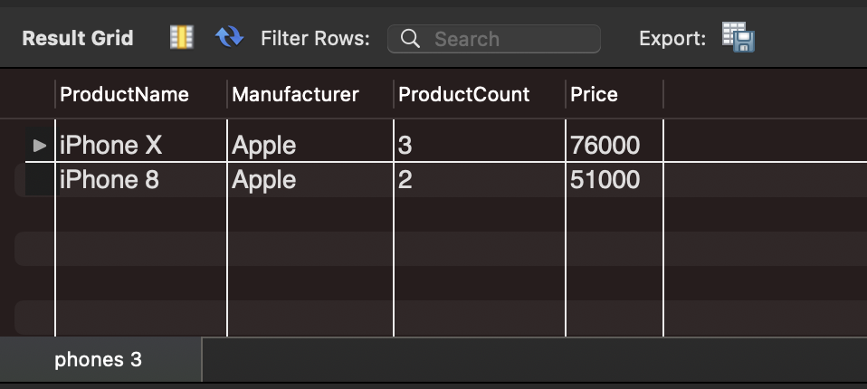
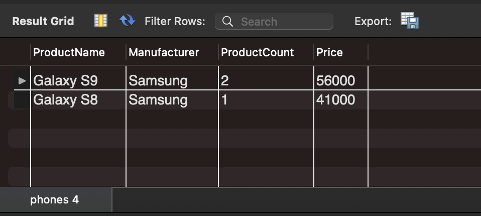
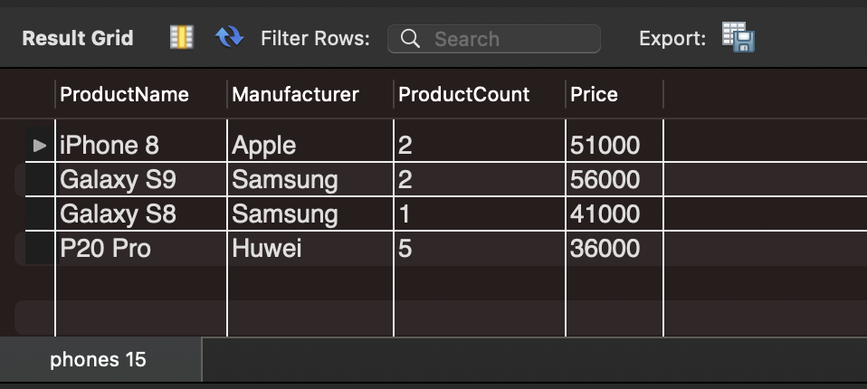
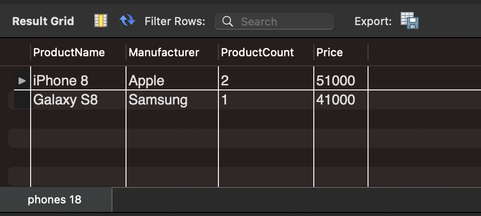

# Базы данных и SQL (семинары)

## Урок 1. Установка СУБД, подключение к БД, просмотр и создание таблиц

1. Создайте таблицу с мобильными телефонами, используя графический интерфейс. Заполните БД данными.

   
   
2. Выведите название, производителя и цену для товаров, количество которых превышает 2

```
use lesson1;

select ProductName, Manufacturer, Price
from phones
where ProductCount > 2;
```
 2" style="width:700px;"/>

3. Выведите весь ассортимент товаров марки "Samsung"

```
use lesson1;

select ProductName from phones
where Manufacturer = 'Samsung';
```


4.  С помощью регулярных выражений найти (можно использовать операторы “LIKE”, “RLIKE”):
    - Товары, в которых есть упоминание "Iphone"
        ```
        use lesson1;

        select ProductName, Manufacturer, ProductCount, Price from phones
        where ProductName LIKE '%iPhone%'; 
        ```
    
    
    - "Galaxy"
        ```
        use lesson1;

        select ProductName, Manufacturer, ProductCount, Price from phones
        where ProductName LIKE '%Galaxy%'; 
        ```
    

    - Товары, в которых есть ЦИФРЫ

        ```
        use lesson1;

        select ProductName, Manufacturer, ProductCount, Price from phones
        where ProductName rlike '\\d';
        ```
        

    - Товары, в которых есть ЦИФРА "8"

        ```
        use lesson1;

        select ProductName, Manufacturer, ProductCount, Price from phones
        where ProductName rlike '8';
        ```
        или

        ```
        use lesson1;

        select ProductName, Manufacturer, ProductCount, Price from phones
        where ProductName like '%8%';
        ```

         