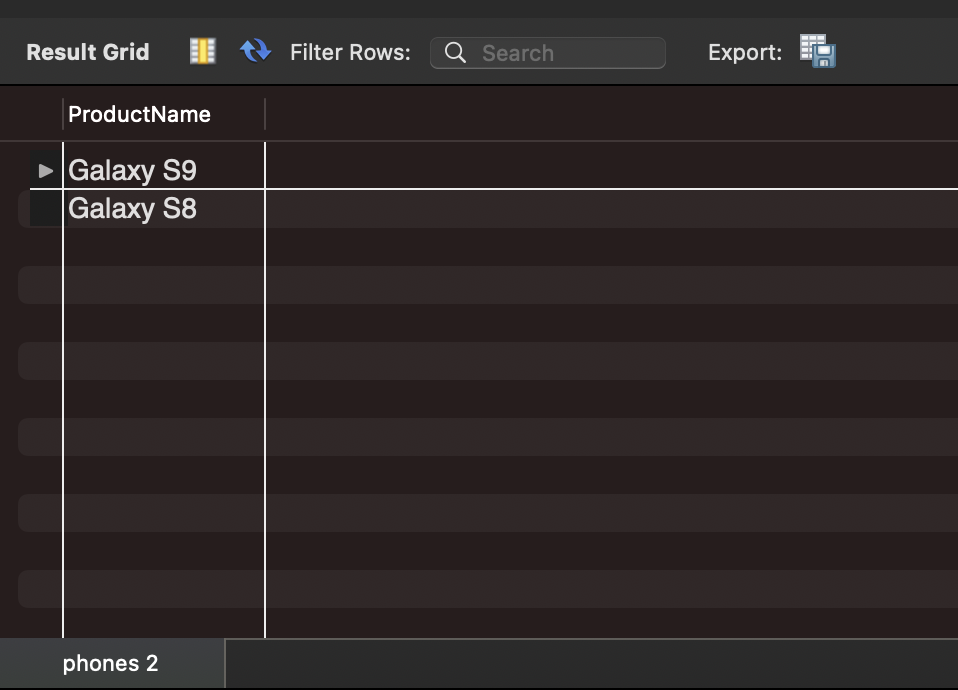

# Базы данных и SQL (семинары)
## Урок 1. Установка СУБД, подключение к БД, просмотр и создание таблиц

### _**Задание1**_
1. Создайте таблицу с мобильными телефонами, используя графический интерфейс. Заполните БД данными.

   
   
2. Выведите название, производителя и цену для товаров, количество которых превышает 2

```
use lesson1;

select ProductName, Manufacturer, Price
from phones
where ProductCount > 2;
```
 2" style="width:700px;"/>

3. Выведите весь ассортимент товаров марки "Samsung"

```
use lesson1;

select ProductName from phones
where Manufacturer = 'Samsung';
```
